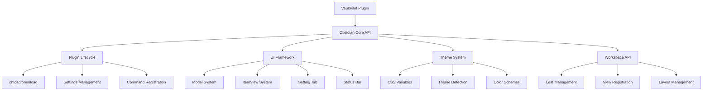
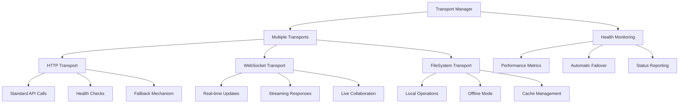
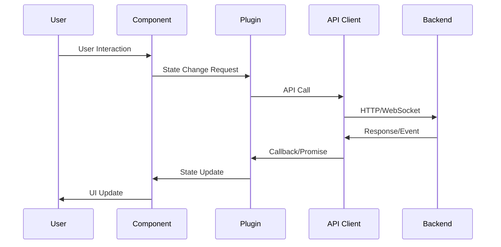
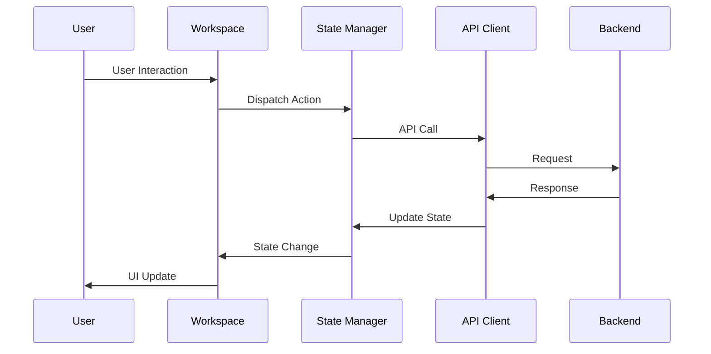
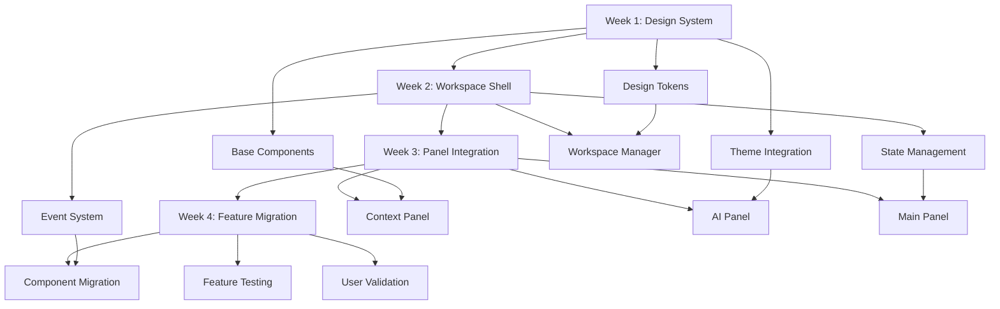

# VaultPilot Phase 1 Context Management Framework

## 🎯 Framework Overview

This document establishes the comprehensive context management framework for implementing Phase 1 of VaultPilot's UI/UX overhaul (Foundation Architecture, Weeks 1-4) using a systematic approach to ensure spectacular outcomes while minimizing risks.

---

## 📊 Dependencies & Integration Points Mapping

### 🔗 Critical Integration Points

#### 1. **Obsidian Platform Integration**



**Integration Constraints:**
- Must maintain Plugin class inheritance and lifecycle
- Cannot break existing view registration patterns
- Theme system integration must be preserved
- Command palette integration must remain functional

#### 2. **EvoAgentX Backend Integration**

```mermaid
graph TD
    A[VaultPilot Frontend] --> B[EvoAgentX API]
    B --> C[REST Endpoints]
    B --> D[WebSocket Connection]
    B --> E[Model Selection]
    B --> F[Agent Services]
    
    C --> C1[/api/obsidian/chat]
    C --> C2[/api/obsidian/workflow]
    C --> C3[/api/obsidian/vault/context]
    C --> C4[/api/obsidian/planning/tasks]
    
    D --> D1[Real-time Chat]
    D --> D2[Workflow Progress]
    D --> D3[Agent Evolution]
    D --> D4[System Health]
    
    E --> E1[Model Health Check]
    E --> E2[Cost Optimization]
    E --> E3[Performance Metrics]
    
    F --> F1[Agent Marketplace]
    F --> F2[Agent Evolution]
    F --> F3[Multi-modal Intelligence]
```

**Critical Dependencies:**
- API client singleton pattern must be preserved
- WebSocket connection state management is crucial
- Real-time event handling cannot be disrupted
- Error handling and fallback mechanisms must be maintained

#### 3. **DevPipe Transport System**



**UI Integration Requirements:**
- Transport health visualization must be maintained
- Automatic failover feedback to users
- Performance metrics display
- Real-time status updates

### 🔄 Data Flow Architecture

#### Current Data Flow Patterns



#### New Workspace Data Flow



### 🧩 Component Dependency Graph



```mermaid
graph TD
    subgraph "Plugin Core"
        Plugin[VaultPilotPlugin]
        Settings[Settings Manager]
        API[API Client]
    end
    
    subgraph "Current Components"
        Chat[AdvancedChatModal]
        Dashboard[EnhancedDashboard]
        Transport[TransportDashboard]
        Marketplace[AgentMarketplaceModal]
        Onboarding[OnboardingWizard]
        Phase3[Phase3Integration]
        AdvSettings[AdvancedSettings]
    end
    
    subgraph "New Architecture"
        Workspace[Unified Workspace]
        ContextPanel[Context Panel]
        AIPanel[AI Panel]
        MainPanel[Main Panel]
        CommandBar[Command Bar]
    end
    
    subgraph "Shared Services"
        StateManager[State Manager]
        EventSystem[Event System]
        ThemeManager[Theme Manager]
        HealthMonitor[Health Monitor]
    end
    
    Plugin --> Settings
    Plugin --> API
    Plugin --> Phase3
    
    Phase3 --> Chat
    Phase3 --> Dashboard
    Phase3 --> Transport
    Phase3 --> Marketplace
    Phase3 --> Onboarding
    
    Settings --> AdvSettings
    
    %% New Architecture Connections
    Plugin -.-> Workspace
    Workspace -.-> ContextPanel
    Workspace -.-> AIPanel
    Workspace -.-> MainPanel
    Workspace -.-> CommandBar
    
    %% Service Connections
    Workspace -.-> StateManager
    Workspace -.-> EventSystem
    Workspace -.-> ThemeManager
    Workspace -.-> HealthMonitor
    
    StateManager -.-> API
    EventSystem -.-> API
    HealthMonitor -.-> API
```

### ⚙️ Service Integration Points

#### 1. **Model Selection Service**

**Current Integration:**
```typescript
// In main.ts
async initializeModelSelection(): Promise<void> {
  this.modelSelectionService = new ModelSelectionService(
    this.settings.backendUrl,
    this.settings.modelSelection.devpipePath
  );
  
  await this.modelSelectionService.updatePreferences({
    priority: this.settings.modelSelection.userPreferences.priority,
    max_cost_per_request: this.settings.modelSelection.userPreferences.maxCostPerRequest
  });
}
```

**New Workspace Integration Requirements:**
- Service must be accessible from unified workspace
- Model health status needs real-time display in AI Panel
- Model selection transparency required in Context Panel
- Cost tracking integration with analytics dashboard

#### 2. **Vault Management Service**

**Current Integration:**
```typescript
// Vault management initialization
if (this.settings.vaultManagement?.enableVaultManagement) {
  this.vaultClient = new VaultManagementClient(
    this.settings.backendUrl,
    this.settings.vaultManagement.apiKey
  );
}
```

**New Workspace Integration Requirements:**
- Vault state visualization in Context Panel
- File operation feedback in Main Panel
- Bulk operation progress in AI Panel
- Context source management in unified interface

#### 3. **Settings Management**

**Current Pattern:**
```typescript
// Settings integration across components
async loadSettings() {
  this.settings = Object.assign({}, DEFAULT_SETTINGS, await this.loadData());
}

async saveSettings() {
  await this.saveData(this.settings);
  // Trigger component updates
}
```

**Migration Requirements:**
- Settings changes must trigger workspace updates
- Real-time validation feedback required
- Profile switching must update entire workspace
- Configuration export/import preservation

### 🔌 WebSocket Event Mapping

#### Current WebSocket Events

```typescript
interface WebSocketEvents {
  onChat: (data: ChatStreamData) => void;
  onWorkflowProgress: (data: WorkflowProgressData) => void;
  onCopilot: (data: CopilotSuggestionData) => void;
  onVaultSync: (data: VaultSyncData) => void;
  onAgentEvolution: (data: AgentEvolutionData) => void;
  onModelHealth: (data: ModelHealthData) => void;
  onTransportStatus: (data: TransportStatusData) => void;
}
```

#### New Workspace Event Handling

```typescript
interface WorkspaceEvents {
  // Chat Events -> Main Panel (Chat Mode)
  'chat:message': (data: ChatStreamData) => void;
  'chat:typing': (data: TypingIndicatorData) => void;
  'chat:error': (data: ErrorData) => void;
  
  // Workflow Events -> Main Panel (Workflow Mode)
  'workflow:progress': (data: WorkflowProgressData) => void;
  'workflow:complete': (data: WorkflowResultData) => void;
  'workflow:error': (data: ErrorData) => void;
  
  // Context Events -> Context Panel
  'context:updated': (data: ContextData) => void;
  'vault:sync': (data: VaultSyncData) => void;
  'files:changed': (data: FileChangeData) => void;
  
  // AI Events -> AI Panel
  'agent:evolution': (data: AgentEvolutionData) => void;
  'model:health': (data: ModelHealthData) => void;
  'ai:insights': (data: AIInsightData) => void;
  
  // System Events -> Command Bar
  'system:status': (data: SystemStatusData) => void;
  'transport:status': (data: TransportStatusData) => void;
  'performance:metrics': (data: PerformanceData) => void;
}
```

### 🎨 Theme Integration Mapping

#### Current Theme Integration

```css
/* Existing pattern in components */
.vaultpilot-component {
  background: var(--background-primary);
  color: var(--text-normal);
  border: 1px solid var(--background-modifier-border);
}

/* Responsive patterns */
@media (max-width: 768px) {
  .vaultpilot-grid {
    grid-template-columns: 1fr;
  }
}
```

#### New Design System Integration

```css
/* New token-based approach */
.vp-workspace {
  background: var(--vp-color-bg-primary);
  color: var(--vp-color-text-primary);
  border: 1px solid var(--vp-color-bg-tertiary);
  border-radius: var(--vp-radius-lg);
  padding: var(--vp-space-lg);
}

/* Component-specific tokens */
.vp-context-panel {
  --panel-bg: var(--vp-color-bg-secondary);
  --panel-border: var(--vp-color-bg-tertiary);
  --panel-text: var(--vp-color-text-secondary);
}

/* Responsive design tokens */
@media (min-width: 768px) {
  .vp-workspace {
    --workspace-columns: 3;
    --panel-min-width: 250px;
  }
}
```

---

## 🛡️ Risk Assessment & Mitigation

### High-Risk Integration Points

#### 1. **Plugin Lifecycle Disruption**
- **Risk**: Breaking Obsidian plugin initialization
- **Impact**: Plugin fails to load or crashes Obsidian
- **Mitigation**: Preserve exact lifecycle patterns, add feature flags

#### 2. **WebSocket Connection Loss**
- **Risk**: Real-time features stop working during migration
- **Impact**: Users lose live chat and workflow updates
- **Mitigation**: Maintain connection in plugin core, add connection monitoring

#### 3. **Settings Data Loss**
- **Risk**: User configuration lost during migration
- **Impact**: Users need to reconfigure everything
- **Mitigation**: Settings schema migration with backup/restore

#### 4. **API Client State Corruption**
- **Risk**: Multiple components accessing API client inconsistently
- **Impact**: API calls fail or return incorrect data
- **Mitigation**: Centralized state management with proper synchronization

### Medium-Risk Integration Points

#### 1. **Theme Compatibility Breaking**
- **Risk**: New components don't work with some Obsidian themes
- **Impact**: Visual inconsistencies or unusable interface
- **Mitigation**: Comprehensive theme testing, fallback styles

#### 2. **Performance Degradation**
- **Risk**: New workspace slower than current modals
- **Impact**: Poor user experience, user dissatisfaction
- **Mitigation**: Performance monitoring, lazy loading, optimization

#### 3. **Mobile Responsiveness Issues**
- **Risk**: New interface doesn't work well on mobile
- **Impact**: Mobile users can't use VaultPilot effectively
- **Mitigation**: Mobile-first design, comprehensive responsive testing

### Migration Strategy Dependencies

#### Phase 1 Critical Dependencies



#### Backward Compatibility Requirements

1. **Settings Preservation**: All user settings must be preserved
2. **Feature Parity**: No loss of functionality during migration
3. **Data Integrity**: Conversation history and user data preserved
4. **Command Compatibility**: All existing commands continue to work
5. **Keyboard Shortcuts**: All shortcuts preserved or improved

---

## 📋 Implementation Strategy

### Week 1: Foundation Layer

#### Day 1-2: Design System Implementation
```bash
# Create design system structure
mkdir -p vaultpilot/src/design-system/{tokens,components,utils}
mkdir -p vaultpilot/src/design-system/components/{core,layout,ai-native}

# Implement design tokens
touch vaultpilot/src/design-system/tokens/{colors,spacing,typography,shadows}.css
touch vaultpilot/src/design-system/tokens/index.css

# Create base components
touch vaultpilot/src/design-system/components/core/{Button,Input,Card,Modal}.ts
touch vaultpilot/src/design-system/components/layout/{Grid,Panel,Container}.ts
touch vaultpilot/src/design-system/components/ai-native/{AIConfidence,ContextSource,AgentStatus}.ts
```

#### Day 3-5: Workspace Architecture
```bash
# Create workspace structure
mkdir -p vaultpilot/src/workspace/{core,panels,state,events}

# Implement core workspace
touch vaultpilot/src/workspace/core/{WorkspaceManager,ModeManager,ThemeManager}.ts
touch vaultpilot/src/workspace/state/{StateManager,ContextProvider,EventBus}.ts
touch vaultpilot/src/workspace/panels/{ContextPanel,AIPanel,MainPanel,CommandBar}.ts
```

### Week 2: Integration Layer

#### Day 1-3: State Management Integration
```typescript
// State manager integration with existing systems
class WorkspaceStateManager {
  private plugin: VaultPilotPlugin;
  private apiClient: EvoAgentXClient;
  private settings: VaultPilotSettings;
  
  constructor(plugin: VaultPilotPlugin) {
    this.plugin = plugin;
    this.apiClient = plugin.apiClient;
    this.settings = plugin.settings;
  }
  
  // Preserve existing API client patterns
  async executeAction(action: WorkspaceAction) {
    switch (action.type) {
      case 'CHAT_MESSAGE':
        return this.apiClient.sendChatMessage(action.payload);
      case 'WORKFLOW_EXECUTE':
        return this.apiClient.executeWorkflow(action.payload);
      // ... other actions
    }
  }
}
```

#### Day 4-5: Event System Integration
```typescript
// Event system that preserves WebSocket integration
class WorkspaceEventSystem {
  private plugin: VaultPilotPlugin;
  private eventBus: EventEmitter;
  
  constructor(plugin: VaultPilotPlugin) {
    this.plugin = plugin;
    this.eventBus = new EventEmitter();
    this.setupWebSocketHandlers();
  }
  
  private setupWebSocketHandlers() {
    this.plugin.apiClient.connectWebSocket({
      onChat: (data) => this.eventBus.emit('chat:message', data),
      onWorkflowProgress: (data) => this.eventBus.emit('workflow:progress', data),
      // ... map all existing WebSocket events
    });
  }
}
```

### Week 3: Panel Implementation

#### Day 1-2: Context Panel
```typescript
// Context Panel with backward compatibility
class ContextPanel extends Component {
  private plugin: VaultPilotPlugin;
  private vaultClient: VaultManagementClient;
  
  constructor(plugin: VaultPilotPlugin) {
    super();
    this.plugin = plugin;
    this.vaultClient = plugin.vaultClient;
  }
  
  // Preserve existing vault integration patterns
  async updateContext() {
    const vaultState = await this.vaultClient.getVaultState();
    const activeFiles = this.plugin.app.workspace.getActiveFile();
    // Update context display
  }
}
```

#### Day 3-5: AI Panel and Main Panel
```typescript
// AI Panel with model selection integration
class AIPanel extends Component {
  private modelService: ModelSelectionService;
  private healthMonitor: HealthMonitor;
  
  constructor(plugin: VaultPilotPlugin) {
    super();
    this.modelService = plugin.modelSelectionService;
    this.setupHealthMonitoring();
  }
  
  private setupHealthMonitoring() {
    // Preserve existing health monitoring patterns
    setInterval(() => {
      this.updateModelHealth();
      this.updateAgentStatus();
    }, 30000);
  }
}
```

### Week 4: Migration and Integration

#### Day 1-3: Component Migration
```typescript
// Feature flag system for gradual migration
class FeatureFlags {
  static isNewWorkspaceEnabled(settings: VaultPilotSettings): boolean {
    return settings.experimental?.useNewWorkspace ?? false;
  }
  
  static shouldMigrateComponent(componentName: string, settings: VaultPilotSettings): boolean {
    return settings.experimental?.migratedComponents?.includes(componentName) ?? false;
  }
}

// Plugin integration with feature flags
class VaultPilotPlugin extends Plugin {
  async onload() {
    await this.loadSettings();
    
    if (FeatureFlags.isNewWorkspaceEnabled(this.settings)) {
      await this.initializeNewWorkspace();
    } else {
      await this.initializeLegacyComponents();
    }
  }
}
```

#### Day 4-5: Testing and Validation
```typescript
// Comprehensive testing framework
describe('Phase 1 Integration', () => {
  test('preserves all existing functionality', async () => {
    // Test that all existing features work
  });
  
  test('maintains WebSocket connectivity', async () => {
    // Test real-time features continue working
  });
  
  test('preserves user settings', async () => {
    // Test settings migration
  });
  
  test('maintains theme compatibility', async () => {
    // Test across different Obsidian themes
  });
});
```

---

## ✅ Success Criteria & Validation

### Technical Validation Checklist

#### Week 1 Milestones
- [ ] Design system tokens implemented and integrated with Obsidian themes
- [ ] Base components created with accessibility compliance
- [ ] Workspace manager initializes without errors
- [ ] Theme switching works correctly
- [ ] Mobile responsive design validated

#### Week 2 Milestones
- [ ] State management preserves all existing plugin state
- [ ] Event system maintains all WebSocket functionality
- [ ] API client integration works without changes to backend
- [ ] Settings management preserves user configuration
- [ ] Performance meets or exceeds current implementation

#### Week 3 Milestones
- [ ] Context Panel displays vault state correctly
- [ ] AI Panel shows real-time agent and model status
- [ ] Main Panel loads and displays content appropriately
- [ ] Command Bar provides all existing functionality
- [ ] Panel resizing and collapsing works smoothly

#### Week 4 Milestones
- [ ] Component migration completed without functionality loss
- [ ] Feature flags enable gradual user migration
- [ ] All existing commands and shortcuts work
- [ ] User testing validates improved experience
- [ ] Performance optimization targets met

### User Experience Validation

#### Functionality Preservation
- All existing features accessible in new interface
- No loss of conversation history or user data
- Settings and preferences preserved exactly
- Keyboard shortcuts maintain or improve efficiency

#### Performance Improvements
- Initial load time ≤ 2 seconds (target: 30% improvement)
- Interaction response time ≤ 500ms
- Memory usage same or lower than current implementation
- Smooth animations and transitions

#### Accessibility Compliance
- WCAG 2.1 AA compliance for all components
- Full keyboard navigation support
- Screen reader compatibility
- High contrast theme support

---

## 🔄 Continuous Monitoring

### Real-Time Validation Framework

```typescript
// Integration health monitoring
class IntegrationHealthMonitor {
  private plugin: VaultPilotPlugin;
  private metrics: Map<string, HealthMetric> = new Map();
  
  constructor(plugin: VaultPilotPlugin) {
    this.plugin = plugin;
    this.startMonitoring();
  }
  
  private startMonitoring() {
    // Monitor API client health
    this.monitorAPIClient();
    
    // Monitor WebSocket connectivity
    this.monitorWebSocket();
    
    // Monitor component performance
    this.monitorComponentPerformance();
    
    // Monitor user interactions
    this.monitorUserExperience();
  }
  
  getHealthReport(): HealthReport {
    return {
      apiClient: this.metrics.get('apiClient'),
      webSocket: this.metrics.get('webSocket'),
      performance: this.metrics.get('performance'),
      userExperience: this.metrics.get('userExperience')
    };
  }
}
```

This comprehensive context management framework provides the foundation for spectacular Phase 1 implementation by ensuring all integration points are mapped, dependencies are understood, and risks are mitigated through systematic planning and continuous validation.