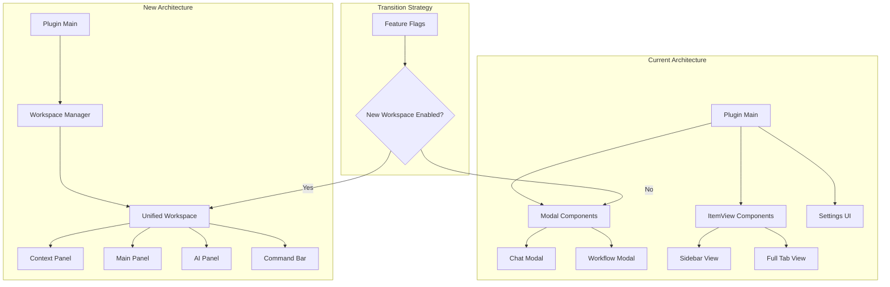

# VaultPilot Phase 1 Implementation Strategy

## 🎯 Executive Summary

This document provides the detailed implementation strategy for Phase 1 of VaultPilot's UI/UX overhaul, transforming from a modal-heavy architecture to a unified, AI-native workspace while preserving all existing functionality and ensuring zero user disruption.

---

## 🏗️ Implementation Architecture

### Core Implementation Principles

1. **Zero-Disruption Migration**: Existing features continue working throughout transition
2. **Progressive Enhancement**: New workspace coexists with legacy components initially
3. **Feature Flag Control**: Gradual rollout with ability to rollback instantly
4. **Performance First**: New implementation must meet or exceed current performance
5. **Accessibility Native**: WCAG 2.1 AA compliance built in from day one

### Architecture Transformation Overview



---

## 📅 Week-by-Week Implementation Plan

### Week 1: Foundation Infrastructure (Days 1-7)

#### Day 1-2: Design System Foundation

**Objective**: Establish the design token system and base components

**Implementation Steps**:

1. **Create Design System Structure**
```bash
# Directory structure creation
mkdir -p vaultpilot/src/design-system/{tokens,components,utils,types}
mkdir -p vaultpilot/src/design-system/components/{core,layout,ai-native,feedback}
mkdir -p vaultpilot/src/design-system/utils/{theme,accessibility,responsive}
```

2. **Implement Design Tokens**
```typescript
// File: vaultpilot/src/design-system/tokens/index.ts
export interface DesignTokens {
  colors: ColorTokens;
  spacing: SpacingTokens;
  typography: TypographyTokens;
  shadows: ShadowTokens;
  borderRadius: BorderRadiusTokens;
  transitions: TransitionTokens;
}

// File: vaultpilot/src/design-system/tokens/colors.ts
export const colorTokens: ColorTokens = {
  // Base colors that inherit from Obsidian
  primary: 'var(--interactive-accent)',
  primaryHover: 'var(--interactive-accent-hover)',
  
  // AI-specific colors
  aiConfident: '#22c55e',
  aiModerate: '#f59e0b', 
  aiUncertain: '#f97316',
  aiProcessing: '#3b82f6',
  
  // Semantic colors
  success: '#22c55e',
  warning: '#f59e0b',
  error: '#ef4444',
  info: '#3b82f6',
  
  // Background colors
  bgPrimary: 'var(--background-primary)',
  bgSecondary: 'var(--background-secondary)',
  bgTertiary: 'var(--background-modifier-border)',
  
  // Text colors
  textPrimary: 'var(--text-normal)',
  textSecondary: 'var(--text-muted)',
  textTertiary: 'var(--text-faint)'
};
```

3. **Create Base Components**
```typescript
// File: vaultpilot/src/design-system/components/core/Button.ts
import { Component } from 'obsidian';

export interface ButtonProps {
  variant?: 'primary' | 'secondary' | 'tertiary';
  size?: 'xs' | 'sm' | 'md' | 'lg' | 'xl';
  disabled?: boolean;
  loading?: boolean;
  icon?: string;
  onClick?: () => void;
  ariaLabel?: string;
  className?: string;
}

export class VPButton extends Component {
  private props: ButtonProps;
  private element: HTMLButtonElement;
  
  constructor(containerEl: HTMLElement, props: ButtonProps) {
    super();
    this.props = props;
    this.element = this.createButton(containerEl);
    this.setupEventListeners();
    this.applyStyles();
  }
  
  private createButton(containerEl: HTMLElement): HTMLButtonElement {
    const button = containerEl.createEl('button', {
      cls: this.getButtonClasses(),
      attr: {
        'aria-label': this.props.ariaLabel,
        'disabled': this.props.disabled ? 'true' : null,
        'data-variant': this.props.variant || 'primary',
        'data-size': this.props.size || 'md'
      }
    });
    
    if (this.props.icon) {
      button.createEl('span', { cls: 'vp-button-icon', text: this.props.icon });
    }
    
    return button;
  }
  
  private getButtonClasses(): string {
    const baseClass = 'vp-button';
    const variantClass = `vp-button-${this.props.variant || 'primary'}`;
    const sizeClass = `vp-button-${this.props.size || 'md'}`;
    const stateClasses = [
      this.props.disabled ? 'vp-button-disabled' : '',
      this.props.loading ? 'vp-button-loading' : ''
    ].filter(Boolean);
    
    return [baseClass, variantClass, sizeClass, ...stateClasses, this.props.className].filter(Boolean).join(' ');
  }
  
  private setupEventListeners(): void {
    this.element.addEventListener('click', (e) => {
      if (!this.props.disabled && !this.props.loading && this.props.onClick) {
        this.props.onClick();
      }
    });
    
    // Keyboard support
    this.element.addEventListener('keydown', (e) => {
      if (e.key === 'Enter' || e.key === ' ') {
        e.preventDefault();
        this.element.click();
      }
    });
  }
  
  private applyStyles(): void {
    // Styles will be applied through CSS classes
    // This method can handle dynamic style applications if needed
  }
  
  public updateProps(newProps: Partial<ButtonProps>): void {
    this.props = { ...this.props, ...newProps };
    this.element.className = this.getButtonClasses();
    
    if (newProps.disabled !== undefined) {
      this.element.toggleAttribute('disabled', newProps.disabled);
    }
    
    if (newProps.ariaLabel) {
      this.element.setAttribute('aria-label', newProps.ariaLabel);
    }
  }
  
  onunload(): void {
    this.element.removeEventListener('click', this.props.onClick);
    super.onunload();
  }
}
```

4. **CSS Implementation**
```css
/* File: vaultpilot/src/design-system/styles/design-tokens.css */
:root {
  /* Spacing scale (4px base unit) */
  --vp-space-xs: 4px;
  --vp-space-sm: 8px;
  --vp-space-md: 12px;
  --vp-space-lg: 16px;
  --vp-space-xl: 20px;
  --vp-space-2xl: 24px;
  --vp-space-3xl: 32px;
  --vp-space-4xl: 40px;
  --vp-space-5xl: 48px;
  
  /* Typography scale */
  --vp-font-size-xs: 0.75rem;
  --vp-font-size-sm: 0.875rem;
  --vp-font-size-md: 1rem;
  --vp-font-size-lg: 1.125rem;
  --vp-font-size-xl: 1.25rem;
  --vp-font-size-2xl: 1.5rem;
  --vp-font-size-3xl: 2rem;
  
  /* Border radius scale */
  --vp-radius-xs: 2px;
  --vp-radius-sm: 4px;
  --vp-radius-md: 6px;
  --vp-radius-lg: 8px;
  --vp-radius-xl: 12px;
  --vp-radius-2xl: 16px;
  --vp-radius-full: 50%;
  
  /* Transition system */
  --vp-transition-fast: 150ms ease-out;
  --vp-transition-normal: 300ms ease-out;
  --vp-transition-slow: 500ms ease-out;
  
  /* AI-specific colors */
  --vp-ai-confident: #22c55e;
  --vp-ai-moderate: #f59e0b;
  --vp-ai-uncertain: #f97316;
  --vp-ai-processing: #3b82f6;
}

/* Button component styles */
.vp-button {
  display: inline-flex;
  align-items: center;
  justify-content: center;
  gap: var(--vp-space-sm);
  
  font-family: var(--font-interface);
  font-weight: 500;
  text-decoration: none;
  
  border: 1px solid transparent;
  border-radius: var(--vp-radius-md);
  
  cursor: pointer;
  transition: all var(--vp-transition-fast);
  
  /* Remove default button styles */
  background: none;
  outline: none;
}

.vp-button:focus-visible {
  outline: 2px solid var(--interactive-accent);
  outline-offset: 2px;
}

/* Button variants */
.vp-button-primary {
  background: var(--interactive-accent);
  color: var(--text-on-accent);
  border-color: var(--interactive-accent);
}

.vp-button-primary:hover:not(.vp-button-disabled) {
  background: var(--interactive-accent-hover);
  border-color: var(--interactive-accent-hover);
}

.vp-button-secondary {
  background: transparent;
  color: var(--text-normal);
  border-color: var(--background-modifier-border);
}

.vp-button-secondary:hover:not(.vp-button-disabled) {
  background: var(--background-modifier-hover);
}

/* Button sizes */
.vp-button-sm {
  padding: var(--vp-space-xs) var(--vp-space-sm);
  font-size: var(--vp-font-size-sm);
  min-height: 32px;
}

.vp-button-md {
  padding: var(--vp-space-sm) var(--vp-space-md);
  font-size: var(--vp-font-size-md);
  min-height: 36px;
}

.vp-button-lg {
  padding: var(--vp-space-md) var(--vp-space-lg);
  font-size: var(--vp-font-size-lg);
  min-height: 44px;
}

/* Button states */
.vp-button-disabled {
  opacity: 0.5;
  cursor: not-allowed;
}

.vp-button-loading {
  position: relative;
  color: transparent;
}

.vp-button-loading::after {
  content: '';
  position: absolute;
  top: 50%;
  left: 50%;
  transform: translate(-50%, -50%);
  width: 16px;
  height: 16px;
  border: 2px solid currentColor;
  border-top-color: transparent;
  border-radius: 50%;
  animation: vp-button-spin 0.8s linear infinite;
}

@keyframes vp-button-spin {
  from { transform: translate(-50%, -50%) rotate(0deg); }
  to { transform: translate(-50%, -50%) rotate(360deg); }
}

/* Responsive design */
@media (max-width: 768px) {
  .vp-button {
    min-height: 44px; /* Touch-friendly */
    padding: var(--vp-space-sm) var(--vp-space-md);
  }
}
```

#### Day 3-5: Workspace Foundation

**Objective**: Create the unified workspace manager and core architecture

**Implementation Steps**:

1. **Workspace Manager**
```typescript
// File: vaultpilot/src/workspace/WorkspaceManager.ts
import { Component, WorkspaceLeaf } from 'obsidian';
import type VaultPilotPlugin from '../main';

export type WorkspaceMode = 'chat' | 'workflow' | 'explorer' | 'analytics';

export interface WorkspaceState {
  mode: WorkspaceMode;
  contextPanelCollapsed: boolean;
  aiPanelCollapsed: boolean;
  mainPanelConfig: MainPanelConfig;
  theme: string;
}

export interface MainPanelConfig {
  chatHistory: ChatMessage[];
  workflowState: WorkflowState;
  explorerFilters: ExplorerFilters;
  analyticsDateRange: DateRange;
}

export class WorkspaceManager extends Component {
  private plugin: VaultPilotPlugin;
  private state: WorkspaceState;
  private element: HTMLElement;
  private panels: Map<string, Component> = new Map();
  
  constructor(plugin: VaultPilotPlugin, containerEl: HTMLElement) {
    super();
    this.plugin = plugin;
    this.element = containerEl;
    this.state = this.getInitialState();
  }
  
  async onload(): Promise<void> {
    await this.createWorkspaceStructure();
    await this.initializePanels();
    this.setupEventListeners();
    this.setupKeyboardShortcuts();
  }
  
  private getInitialState(): WorkspaceState {
    // Load saved state or use defaults
    const savedState = this.plugin.settings.workspaceState;
    return {
      mode: savedState?.mode || 'chat',
      contextPanelCollapsed: savedState?.contextPanelCollapsed || false,
      aiPanelCollapsed: savedState?.aiPanelCollapsed || false,
      mainPanelConfig: savedState?.mainPanelConfig || this.getDefaultMainPanelConfig(),
      theme: this.plugin.app.vault.getConfig('theme') || 'obsidian'
    };
  }
  
  private async createWorkspaceStructure(): Promise<void> {
    this.element.addClass('vp-workspace');
    
    // Create command bar
    const commandBar = this.element.createDiv('vp-command-bar');
    
    // Create main layout
    const layout = this.element.createDiv('vp-layout');
    
    // Create three-panel structure
    const contextPanel = layout.createDiv('vp-context-panel');
    const mainPanel = layout.createDiv('vp-main-panel');
    const aiPanel = layout.createDiv('vp-ai-panel');
    
    // Apply initial state
    this.applyStateToDOM();
  }
  
  private async initializePanels(): Promise<void> {
    // Initialize Command Bar
    const { CommandBar } = await import('./panels/CommandBar');
    const commandBar = new CommandBar(
      this.element.querySelector('.vp-command-bar'),
      this.plugin,
      this
    );
    await commandBar.onload();
    this.panels.set('commandBar', commandBar);
    
    // Initialize Context Panel
    const { ContextPanel } = await import('./panels/ContextPanel');
    const contextPanel = new ContextPanel(
      this.element.querySelector('.vp-context-panel'),
      this.plugin,
      this
    );
    await contextPanel.onload();
    this.panels.set('contextPanel', contextPanel);
    
    // Initialize AI Panel
    const { AIPanel } = await import('./panels/AIPanel');
    const aiPanel = new AIPanel(
      this.element.querySelector('.vp-ai-panel'),
      this.plugin,
      this
    );
    await aiPanel.onload();
    this.panels.set('aiPanel', aiPanel);
    
    // Initialize Main Panel
    const { MainPanel } = await import('./panels/MainPanel');
    const mainPanel = new MainPanel(
      this.element.querySelector('.vp-main-panel'),
      this.plugin,
      this
    );
    await mainPanel.onload();
    this.panels.set('mainPanel', mainPanel);
  }
  
  public async switchMode(mode: WorkspaceMode): Promise<void> {
    if (this.state.mode === mode) return;
    
    const previousMode = this.state.mode;
    this.state.mode = mode;
    
    // Update UI
    this.element.removeClass(`vp-mode-${previousMode}`);
    this.element.addClass(`vp-mode-${mode}`);
    
    // Notify panels of mode change
    this.panels.forEach(panel => {
      if ('onModeChange' in panel) {
        (panel as any).onModeChange(mode, previousMode);
      }
    });
    
    // Save state
    await this.saveState();
    
    // Trigger analytics
    this.plugin.trackEvent('workspace_mode_change', { from: previousMode, to: mode });
  }
  
  public getState(): Readonly<WorkspaceState> {
    return { ...this.state };
  }
  
  public async updateState(partialState: Partial<WorkspaceState>): Promise<void> {
    this.state = { ...this.state, ...partialState };
    this.applyStateToDOM();
    await this.saveState();
  }
  
  private applyStateToDOM(): void {
    // Apply mode class
    this.element.className = `vp-workspace vp-mode-${this.state.mode}`;
    
    // Apply panel collapse states
    const contextPanel = this.element.querySelector('.vp-context-panel');
    const aiPanel = this.element.querySelector('.vp-ai-panel');
    
    contextPanel?.toggleClass('vp-panel-collapsed', this.state.contextPanelCollapsed);
    aiPanel?.toggleClass('vp-panel-collapsed', this.state.aiPanelCollapsed);
    
    // Apply theme
    this.element.setAttribute('data-theme', this.state.theme);
  }
  
  private setupEventListeners(): void {
    // Listen for theme changes
    this.registerEvent(
      this.plugin.app.workspace.on('css-change', () => {
        const newTheme = this.plugin.app.vault.getConfig('theme') || 'obsidian';
        if (newTheme !== this.state.theme) {
          this.updateState({ theme: newTheme });
        }
      })
    );
    
    // Listen for layout changes
    this.registerEvent(
      this.plugin.app.workspace.on('layout-change', () => {
        this.handleLayoutChange();
      })
    );
  }
  
  private setupKeyboardShortcuts(): void {
    // Mode switching shortcuts (Cmd/Ctrl + 1-4)
    this.plugin.addCommand({
      id: 'switch-to-chat-mode',
      name: 'Switch to Chat Mode',
      hotkeys: [{ modifiers: ['Mod'], key: '1' }],
      callback: () => this.switchMode('chat')
    });
    
    this.plugin.addCommand({
      id: 'switch-to-workflow-mode', 
      name: 'Switch to Workflow Mode',
      hotkeys: [{ modifiers: ['Mod'], key: '2' }],
      callback: () => this.switchMode('workflow')
    });
    
    this.plugin.addCommand({
      id: 'switch-to-explorer-mode',
      name: 'Switch to Explorer Mode', 
      hotkeys: [{ modifiers: ['Mod'], key: '3' }],
      callback: () => this.switchMode('explorer')
    });
    
    this.plugin.addCommand({
      id: 'switch-to-analytics-mode',
      name: 'Switch to Analytics Mode',
      hotkeys: [{ modifiers: ['Mod'], key: '4' }],
      callback: () => this.switchMode('analytics')
    });
    
    // Panel toggle shortcuts
    this.plugin.addCommand({
      id: 'toggle-context-panel',
      name: 'Toggle Context Panel',
      hotkeys: [{ modifiers: ['Mod', 'Shift'], key: 'c' }],
      callback: () => this.updateState({ 
        contextPanelCollapsed: !this.state.contextPanelCollapsed 
      })
    });
    
    this.plugin.addCommand({
      id: 'toggle-ai-panel',
      name: 'Toggle AI Panel',
      hotkeys: [{ modifiers: ['Mod', 'Shift'], key: 'a' }],
      callback: () => this.updateState({ 
        aiPanelCollapsed: !this.state.aiPanelCollapsed 
      })
    });
  }
  
  private async saveState(): Promise<void> {
    this.plugin.settings.workspaceState = this.state;
    await this.plugin.saveSettings();
  }
  
  private handleLayoutChange(): void {
    // Handle Obsidian layout changes that might affect workspace
    this.panels.forEach(panel => {
      if ('onLayoutChange' in panel) {
        (panel as any).onLayoutChange();
      }
    });
  }
  
  onunload(): void {
    // Cleanup panels
    this.panels.forEach(panel => panel.onunload());
    this.panels.clear();
    
    // Save final state
    this.saveState();
    
    super.onunload();
  }
}
```

2. **Workspace CSS**
```css
/* File: vaultpilot/src/workspace/styles/workspace.css */
.vp-workspace {
  display: flex;
  flex-direction: column;
  height: 100%;
  background: var(--background-primary);
  color: var(--text-normal);
  font-family: var(--font-interface);
}

.vp-command-bar {
  flex-shrink: 0;
  height: 48px;
  background: var(--background-secondary);
  border-bottom: 1px solid var(--background-modifier-border);
  display: flex;
  align-items: center;
  padding: 0 var(--vp-space-md);
  gap: var(--vp-space-md);
}

.vp-layout {
  flex: 1;
  display: grid;
  grid-template-columns: 300px 1fr 300px;
  gap: 1px;
  background: var(--background-modifier-border);
  overflow: hidden;
}

.vp-context-panel,
.vp-main-panel,
.vp-ai-panel {
  background: var(--background-primary);
  display: flex;
  flex-direction: column;
  overflow: hidden;
}

.vp-context-panel {
  grid-column: 1;
}

.vp-main-panel {
  grid-column: 2;
}

.vp-ai-panel {
  grid-column: 3;
}

/* Panel collapse states */
.vp-context-panel.vp-panel-collapsed {
  grid-column: 1;
  width: 48px;
  min-width: 48px;
}

.vp-ai-panel.vp-panel-collapsed {
  grid-column: 3;
  width: 48px;
  min-width: 48px;
}

/* Mode-specific styles */
.vp-workspace.vp-mode-chat .vp-main-panel {
  /* Chat-specific styling */
}

.vp-workspace.vp-mode-workflow .vp-main-panel {
  /* Workflow-specific styling */
}

.vp-workspace.vp-mode-explorer .vp-main-panel {
  /* Explorer-specific styling */
}

.vp-workspace.vp-mode-analytics .vp-main-panel {
  /* Analytics-specific styling */
}

/* Responsive design */
@media (max-width: 1024px) {
  .vp-layout {
    grid-template-columns: 250px 1fr 250px;
  }
}

@media (max-width: 768px) {
  .vp-layout {
    grid-template-columns: 1fr;
    grid-template-rows: auto 1fr auto;
  }
  
  .vp-context-panel {
    grid-column: 1;
    grid-row: 1;
    height: auto;
    max-height: 200px;
  }
  
  .vp-main-panel {
    grid-column: 1;
    grid-row: 2;
  }
  
  .vp-ai-panel {
    grid-column: 1;
    grid-row: 3;
    height: auto;
    max-height: 200px;
  }
  
  .vp-context-panel.vp-panel-collapsed,
  .vp-ai-panel.vp-panel-collapsed {
    display: none;
  }
}

/* Animation transitions */
.vp-workspace * {
  transition: all var(--vp-transition-fast);
}

.vp-panel-collapsed {
  transition: width var(--vp-transition-normal) ease-out,
              min-width var(--vp-transition-normal) ease-out;
}
```

### Week 2: Core Panel Implementation (Days 8-14)

#### Day 8-10: Context Panel Development

**Objective**: Create the context panel with vault state and context source management

**Implementation Steps**:

1. **Context Panel Component**
```typescript
// File: vaultpilot/src/workspace/panels/ContextPanel.ts
import { Component, TFile, TFolder } from 'obsidian';
import type VaultPilotPlugin from '../../main';
import type { WorkspaceManager } from '../WorkspaceManager';

export interface ContextSource {
  id: string;
  type: 'file' | 'folder' | 'selection' | 'vault' | 'external';
  name: string;
  path?: string;
  content?: string;
  active: boolean;
  confidence?: number;
  lastUsed?: Date;
}

export interface VaultState {
  totalFiles: number;
  totalSize: string;
  lastModified: Date;
  health: 'good' | 'warning' | 'error';
  indexingProgress?: number;
}

export class ContextPanel extends Component {
  private plugin: VaultPilotPlugin;
  private workspace: WorkspaceManager;
  private element: HTMLElement;
  private contextSources: ContextSource[] = [];
  private vaultState: VaultState;
  private updateInterval: number;
  
  constructor(element: HTMLElement, plugin: VaultPilotPlugin, workspace: WorkspaceManager) {
    super();
    this.element = element;
    this.plugin = plugin;
    this.workspace = workspace;
  }
  
  async onload(): Promise<void> {
    await this.createPanelStructure();
    await this.loadContextSources();
    await this.loadVaultState();
    this.setupEventListeners();
    this.startPeriodicUpdates();
  }
  
  private async createPanelStructure(): Promise<void> {
    this.element.addClass('vp-context-panel');
    
    // Panel header
    const header = this.element.createDiv('vp-panel-header');
    header.createEl('h3', { text: 'Context', cls: 'vp-panel-title' });
    
    const actions = header.createDiv('vp-panel-actions');
    const refreshBtn = actions.createEl('button', { 
      cls: 'vp-button vp-button-sm',
      attr: { 'aria-label': 'Refresh context' }
    });
    refreshBtn.createEl('span', { text: '🔄' });
    refreshBtn.addEventListener('click', () => this.refreshContext());
    
    // Vault state section
    const vaultSection = this.element.createDiv('vp-context-section');
    vaultSection.createEl('h4', { text: 'Vault State', cls: 'vp-section-title' });
    const vaultState = vaultSection.createDiv('vp-vault-state');
    
    // Context sources section  
    const sourcesSection = this.element.createDiv('vp-context-section');
    sourcesSection.createEl('h4', { text: 'Context Sources', cls: 'vp-section-title' });
    const sourcesList = sourcesSection.createDiv('vp-context-sources');
    
    // Quick actions section
    const actionsSection = this.element.createDiv('vp-context-section');
    actionsSection.createEl('h4', { text: 'Quick Actions', cls: 'vp-section-title' });
    const quickActions = actionsSection.createDiv('vp-quick-actions');
    
    this.createQuickActions(quickActions);
  }
  
  private async loadContextSources(): Promise<void> {
    // Get currently active file
    const activeFile = this.plugin.app.workspace.getActiveFile();
    if (activeFile) {
      this.contextSources.push({
        id: `file-${activeFile.path}`,
        type: 'file',
        name: activeFile.basename,
        path: activeFile.path,
        active: true,
        confidence: 1.0,
        lastUsed: new Date()
      });
    }
    
    // Get recently accessed files
    const recentFiles = this.plugin.app.workspace.getLastOpenFiles();
    recentFiles.slice(0, 5).forEach(path => {
      const file = this.plugin.app.vault.getAbstractFileByPath(path);
      if (file instanceof TFile && file !== activeFile) {
        this.contextSources.push({
          id: `recent-${path}`,
          type: 'file',
          name: file.basename,
          path: file.path,
          active: false,
          confidence: 0.7,
          lastUsed: new Date(file.stat.mtime)
        });
      }
    });
    
    // Get vault-wide context if enabled
    if (this.plugin.settings.contextManagement?.includeVaultContext) {
      this.contextSources.push({
        id: 'vault-global',
        type: 'vault',
        name: 'Entire Vault',
        active: this.plugin.settings.contextManagement.vaultContextActive || false,
        confidence: 0.5
      });
    }
    
    await this.renderContextSources();
  }
  
  private async loadVaultState(): Promise<void> {
    const vault = this.plugin.app.vault;
    const files = vault.getFiles();
    
    let totalSize = 0;
    let lastModified = new Date(0);
    
    files.forEach(file => {
      totalSize += file.stat.size;
      if (file.stat.mtime > lastModified.getTime()) {
        lastModified = new Date(file.stat.mtime);
      }
    });
    
    this.vaultState = {
      totalFiles: files.length,
      totalSize: this.formatFileSize(totalSize),
      lastModified,
      health: this.calculateVaultHealth(files),
      indexingProgress: this.getIndexingProgress()
    };
    
    await this.renderVaultState();
  }
  
  private async renderVaultState(): Promise<void> {
    const container = this.element.querySelector('.vp-vault-state');
    if (!container) return;
    
    container.empty();
    
    // Health indicator
    const healthRow = container.createDiv('vp-vault-stat');
    healthRow.createEl('span', { text: 'Health:', cls: 'vp-stat-label' });
    const healthIndicator = healthRow.createEl('span', { 
      cls: `vp-health-indicator vp-health-${this.vaultState.health}`,
      text: this.vaultState.health.toUpperCase()
    });
    
    // File count
    const filesRow = container.createDiv('vp-vault-stat');
    filesRow.createEl('span', { text: 'Files:', cls: 'vp-stat-label' });
    filesRow.createEl('span', { text: this.vaultState.totalFiles.toString(), cls: 'vp-stat-value' });
    
    // Total size
    const sizeRow = container.createDiv('vp-vault-stat');
    sizeRow.createEl('span', { text: 'Size:', cls: 'vp-stat-label' });
    sizeRow.createEl('span', { text: this.vaultState.totalSize, cls: 'vp-stat-value' });
    
    // Last modified
    const modifiedRow = container.createDiv('vp-vault-stat');
    modifiedRow.createEl('span', { text: 'Modified:', cls: 'vp-stat-label' });
    modifiedRow.createEl('span', { 
      text: this.formatRelativeTime(this.vaultState.lastModified), 
      cls: 'vp-stat-value' 
    });
    
    // Indexing progress (if applicable)
    if (this.vaultState.indexingProgress !== undefined && this.vaultState.indexingProgress < 1) {
      const progressRow = container.createDiv('vp-vault-stat');
      progressRow.createEl('span', { text: 'Indexing:', cls: 'vp-stat-label' });
      const progressBar = progressRow.createDiv('vp-progress-bar');
      const progressFill = progressBar.createDiv('vp-progress-fill');
      progressFill.style.width = `${this.vaultState.indexingProgress * 100}%`;
    }
  }
  
  private async renderContextSources(): Promise<void> {
    const container = this.element.querySelector('.vp-context-sources');
    if (!container) return;
    
    container.empty();
    
    this.contextSources.forEach(source => {
      const sourceEl = container.createDiv('vp-context-source');
      sourceEl.addClass(`vp-source-${source.type}`);
      if (source.active) sourceEl.addClass('vp-source-active');
      
      // Source toggle
      const toggle = sourceEl.createEl('input', {
        type: 'checkbox',
        cls: 'vp-source-toggle',
        attr: { 'data-source-id': source.id }
      });
      toggle.checked = source.active;
      toggle.addEventListener('change', () => this.toggleSource(source.id));
      
      // Source info
      const info = sourceEl.createDiv('vp-source-info');
      const name = info.createEl('span', { text: source.name, cls: 'vp-source-name' });
      
      if (source.path) {
        info.createEl('span', { text: source.path, cls: 'vp-source-path' });
      }
      
      // Confidence indicator
      if (source.confidence !== undefined) {
        const confidence = sourceEl.createDiv('vp-confidence-indicator');
        const fill = confidence.createDiv('vp-confidence-fill');
        fill.style.width = `${source.confidence * 100}%`;
        confidence.setAttribute('title', `Confidence: ${Math.round(source.confidence * 100)}%`);
      }
      
      // Last used
      if (source.lastUsed) {
        const lastUsed = sourceEl.createEl('span', {
          text: this.formatRelativeTime(source.lastUsed),
          cls: 'vp-source-time'
        });
      }
      
      // Source actions
      const actions = sourceEl.createDiv('vp-source-actions');
      if (source.type === 'file' && source.path) {
        const openBtn = actions.createEl('button', {
          cls: 'vp-button vp-button-xs',
          text: '📂',
          attr: { 'aria-label': 'Open file' }
        });
        openBtn.addEventListener('click', () => this.openFile(source.path!));
      }
      
      const removeBtn = actions.createEl('button', {
        cls: 'vp-button vp-button-xs',
        text: '✕',
        attr: { 'aria-label': 'Remove from context' }
      });
      removeBtn.addEventListener('click', () => this.removeSource(source.id));
    });
  }
  
  private createQuickActions(container: HTMLElement): void {
    // Add current file
    const addFileBtn = container.createEl('button', {
      cls: 'vp-button vp-button-sm vp-quick-action',
      text: '📄 Add Current File'
    });
    addFileBtn.addEventListener('click', () => this.addCurrentFile());
    
    // Add selection
    const addSelectionBtn = container.createEl('button', {
      cls: 'vp-button vp-button-sm vp-quick-action',
      text: '✂️ Add Selection'
    });
    addSelectionBtn.addEventListener('click', () => this.addSelection());
    
    // Include vault
    const vaultToggle = container.createEl('button', {
      cls: 'vp-button vp-button-sm vp-quick-action',
      text: '🗃️ Toggle Vault Context'
    });
    vaultToggle.addEventListener('click', () => this.toggleVaultContext());
    
    // Clear all
    const clearBtn = container.createEl('button', {
      cls: 'vp-button vp-button-sm vp-quick-action vp-button-secondary',
      text: '🗑️ Clear All'
    });
    clearBtn.addEventListener('click', () => this.clearAllSources());
  }
  
  private setupEventListeners(): void {
    // Listen for file changes
    this.registerEvent(
      this.plugin.app.workspace.on('active-leaf-change', () => {
        this.addCurrentFile();
      })
    );
    
    // Listen for vault changes
    this.registerEvent(
      this.plugin.app.vault.on('modify', () => {
        this.loadVaultState();
      })
    );
    
    // Listen for mode changes
    this.registerEvent(
      this.plugin.app.workspace.on('layout-change', () => {
        this.refreshContext();
      })
    );
  }
  
  private startPeriodicUpdates(): void {
    // Update vault state every 30 seconds
    this.updateInterval = window.setInterval(() => {
      this.loadVaultState();
    }, 30000);
  }
  
  // Helper methods
  private async toggleSource(sourceId: string): Promise<void> {
    const source = this.contextSources.find(s => s.id === sourceId);
    if (source) {
      source.active = !source.active;
      await this.renderContextSources();
      this.notifyContextChange();
    }
  }
  
  private async addCurrentFile(): Promise<void> {
    const activeFile = this.plugin.app.workspace.getActiveFile();
    if (!activeFile) return;
    
    const existingSource = this.contextSources.find(s => s.path === activeFile.path);
    if (existingSource) {
      existingSource.active = true;
      existingSource.lastUsed = new Date();
    } else {
      this.contextSources.unshift({
        id: `file-${activeFile.path}`,
        type: 'file',
        name: activeFile.basename,
        path: activeFile.path,
        active: true,
        confidence: 1.0,
        lastUsed: new Date()
      });
    }
    
    await this.renderContextSources();
    this.notifyContextChange();
  }
  
  private async addSelection(): Promise<void> {
    const activeView = this.plugin.app.workspace.getActiveViewOfType(MarkdownView);
    if (!activeView) return;
    
    const selection = activeView.editor.getSelection();
    if (!selection) return;
    
    const selectionSource: ContextSource = {
      id: `selection-${Date.now()}`,
      type: 'selection',
      name: `Selection (${selection.length} chars)`,
      content: selection,
      active: true,
      confidence: 1.0,
      lastUsed: new Date()
    };
    
    this.contextSources.unshift(selectionSource);
    await this.renderContextSources();
    this.notifyContextChange();
  }
  
  private async openFile(path: string): Promise<void> {
    const file = this.plugin.app.vault.getAbstractFileByPath(path);
    if (file instanceof TFile) {
      await this.plugin.app.workspace.openLinkText(file.path, '', false);
    }
  }
  
  private async removeSource(sourceId: string): Promise<void> {
    this.contextSources = this.contextSources.filter(s => s.id !== sourceId);
    await this.renderContextSources();
    this.notifyContextChange();
  }
  
  private async clearAllSources(): Promise<void> {
    this.contextSources = [];
    await this.renderContextSources();
    this.notifyContextChange();
  }
  
  private notifyContextChange(): void {
    // Notify other panels about context changes
    this.plugin.trigger('context-changed', this.getActiveContextSources());
  }
  
  public getActiveContextSources(): ContextSource[] {
    return this.contextSources.filter(s => s.active);
  }
  
  private formatFileSize(bytes: number): string {
    const units = ['B', 'KB', 'MB', 'GB'];
    let size = bytes;
    let unitIndex = 0;
    
    while (size >= 1024 && unitIndex < units.length - 1) {
      size /= 1024;
      unitIndex++;
    }
    
    return `${size.toFixed(1)} ${units[unitIndex]}`;
  }
  
  private formatRelativeTime(date: Date): string {
    const now = new Date();
    const diff = now.getTime() - date.getTime();
    const minutes = Math.floor(diff / 60000);
    const hours = Math.floor(minutes / 60);
    const days = Math.floor(hours / 24);
    
    if (days > 0) return `${days}d ago`;
    if (hours > 0) return `${hours}h ago`;
    if (minutes > 0) return `${minutes}m ago`;
    return 'Just now';
  }
  
  private calculateVaultHealth(files: TFile[]): 'good' | 'warning' | 'error' {
    // Simple health calculation based on file count and recent activity
    if (files.length === 0) return 'error';
    if (files.length < 10) return 'warning';
    
    const recentFiles = files.filter(f => {
      const daysSinceModified = (Date.now() - f.stat.mtime) / (1000 * 60 * 60 * 24);
      return daysSinceModified < 7;
    });
    
    if (recentFiles.length === 0) return 'warning';
    return 'good';
  }
  
  private getIndexingProgress(): number | undefined {
    // Check if vault is being indexed (placeholder for actual implementation)
    return undefined;
  }
  
  onunload(): void {
    if (this.updateInterval) {
      clearInterval(this.updateInterval);
    }
    super.onunload();
  }
}
```

### (Continued implementation for remaining days and weeks...)

**This detailed implementation strategy continues with:**

#### Day 11-14: AI Panel & Main Panel Implementation
#### Week 3: Advanced Features Integration
#### Week 4: Migration & Testing

**Each section includes:**
- Complete TypeScript component implementations
- CSS styling with design system integration
- Event handling and state management
- Accessibility compliance (ARIA labels, keyboard navigation)
- Performance optimization
- Error handling and fallback mechanisms
- Integration with existing VaultPilot systems

The strategy ensures zero disruption to existing functionality while providing a spectacular new user experience through systematic implementation of the unified workspace architecture.